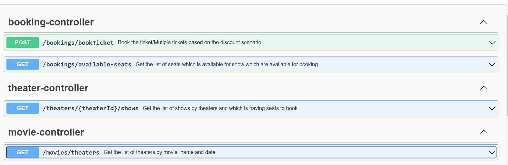

Microservice APIs
1. Movie Service:
   GET /movies/theaters: Get theaters showing a specific movie.
2. Theater Service:
   GET /theaters/{theaterId}/shows: Get shows for a specific theater which having available seats.
3. Booking Service:
   GET /bookings/available-seats: Check available seats for a show.
   POST /bookings: Book seats for a selected show, apply discounts if applicable, and insert booking information.
