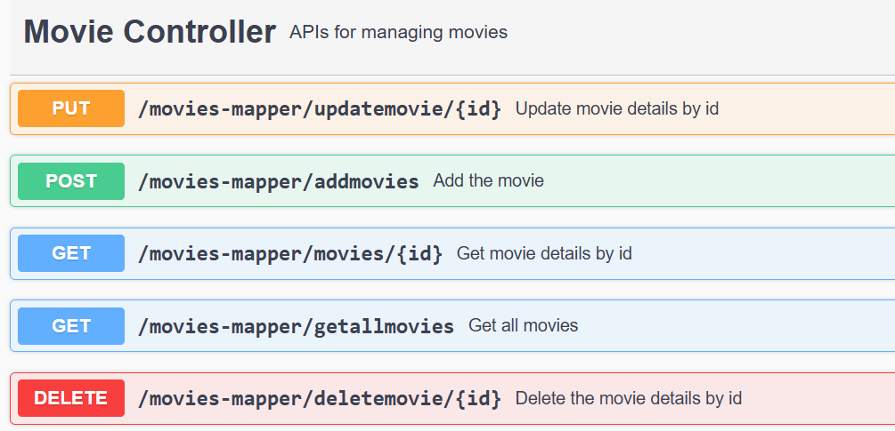
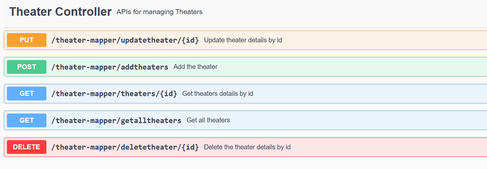

To setup this service 
Installation:
java17
postgresdb
eclipse/Intellij
git clone : https://github.com/Ayvars143/Final_Movie_Ticket_Booking.git

In this service implemented the rest endpoints for the following cases
1. Add movies 
2. Delete Movies
3. Get Movies by id
4. Get all Movies list
5. Update movie details

6. Add Theaters 
7. Delete Theater 
8. Get Theater by id 
9. Get all Theater list 
10. Update Theater details

